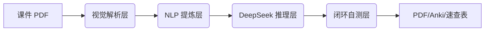

# 🚀 Exam-Master-Skill

> **“别手敲笔记了！让 AI 帮你从乱糟糟的课件中捞出考点。”**

**Exam-Master-Skill** 是一套专为大学生设计的“期末通关”自动化工具。它不只是简单的转码工具，而是通过**视觉特征识别 + 智能降噪 + 闭环逻辑自测**，将密密麻麻、重点模糊的课件 PDF，转化为学霸级复习笔记。

---

## 🎨 视觉预览


---

## ✨ 核心亮点：为什么你需要它？

* **视觉重构**：自动解析课件中的**标红重点**、加粗文字和标题层级，让 AI 精准定位你的“必考点”。
* **语义降噪**：内置废话过滤算法，自动过滤“如图所示”、“请大家看这里”等无效口水话，让 AI 全力挖掘知识点。
* **考点矩阵化**：告别大段文字，强制 AI 输出结构化【考点矩阵表】，涵盖【考频指数】、【命题陷阱】、【关联逻辑】。
* **闭环自测**：自动生成 3 道高难度模拟题，并进行“反向盲区回填”——AI 发现你没掌握的考点，自动补充进笔记。
* **一键全能交付**：不仅有 PDF 笔记，还支持生成：
    * 📄 **A4 考前速查表** (适合进考场前 10 分钟突击)
    * 📇 **Anki 闪卡导入包** (直接导入 Anki 进行科学背诵)

---

## 🛠️ 快速安装

```bash
# 1. 克隆项目
git clone [https://github.com/yourname/Exam-Master-Skill.git](https://github.com/yourname/Exam-Master-Skill.git)
cd Exam-Master-Skill

# 2. 安装依赖
pip install -r requirements.txt

# 3. macOS 额外配置
brew install pango cairo gdk-pixbuf

```

---

## 🚀 一键通关

在终端运行以下命令，即可开启你的复习辅助模式：

| 模式 | 运行命令 |
| --- | --- |
| **基础模式** | `python app.py lecture.pdf` |
| **全量通关模式** | `python app.py lecture.pdf -o 期末必过 --cheat-sheet --apkg --keep-md` |
| **多目录批量** | `python app.py ~/Documents/semester_finals/` |

---

## 📊 学科专属模板

针对不同课程特性，框架内置了不同思维导图模板：

* **STEM (理工)**：公式推导链 + 定理边界条件 + 典型题型
* **Medical (医学)**：机制 → 症状 → 诊断 → 治疗四维闭环
* **Liberal-Arts (文科)**：时间轴 + 因果链 + 学派对比表
* **Business (商科)**：模型框架 + 适用场景 + 局限性

---

## 🏗️ 它是如何工作的？



1. **解析层**：提取 PDF 字号、红字 RGB 值、矢量图骨架。
2. **提炼层**：通过 TextRank 抽取关键句，TF-IDF 权重加持，确保 AI 抓准核心。
3. **推理层**：驱动 DeepSeek 按照学科模板重构知识点。
4. **自测层**：R1 模型出题 -> 对比笔记盲区 -> 精准补充。

---

## 💡 配置说明

在根目录创建 `config.json`：

```json
{
  "DEEPSEEK_API_KEY": "sk-your-key",
  "API_URL": "[https://api.deepseek.com/v1](https://api.deepseek.com/v1)"
}

```

---

*“在考试面前，效率就是胜率。祝你期末 All Pass!”*
